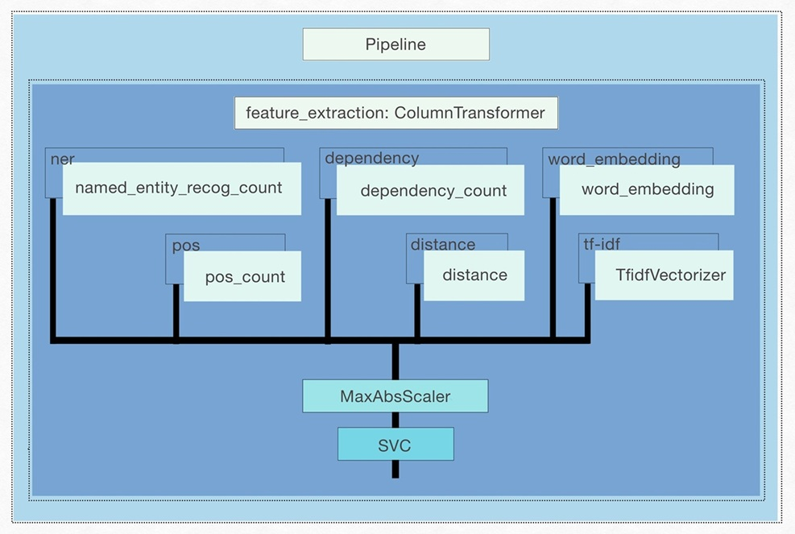
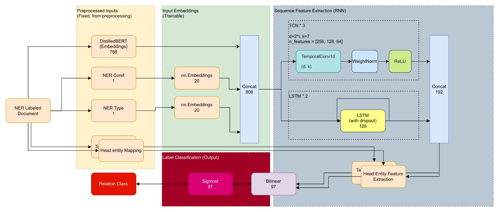

# Implementing Relation Extraction on DocRED dataset
## License

This project is licensed under the Apache 2.0 License - see the [LICENSE](LICENSE) file for details.

## **Getting Started**
### 1. Python (Conda) Environment
Please use the following commands to create and activate a conda environment with all dependencies for this project.
```bash
conda env create -f environment.yml -n "docred"
conda activate docred
```
## 2. Prepare the dataset
Download the dataset and extract all contents to the `dataset_DocRED` direction. Link is avaiable in `dataset_DocRED/README.md`, please also refer to the same README for correct directory structure. 
## 3. Download the pre-processed datasets
Check the files under the tabs `checkpoints/README.md` and `dataset_prep.README.md` to download the necessary files from the [PreRequisites.zip](https://drive.google.com/file/d/1JxYsNiYcqEGftxDuRXr5T8q6r_Iy-vYK/view?usp=sharing)

To improve training and evaluation efficiency the pre-processed datasets are serialized. 
To perform training/evaluation, extrat content files to `dataset_prep` . Alternatively, run preprocessing scipt `utils/prep.py`. 


## Model 1 (Non-DL): Using Support Vector Machine (`SVC(kernel = 'poly')`)

### **About Approach:**

This pipeline is designed for **relation extraction** using Natural Language Processing (NLP) techniques and a Support Vector Machine (SVM) classifier. It follows these steps:

1. **Feature Extraction (`ColumnTransformer`)**
   - Various linguistic and statistical features are extracted from the dataset.
   - Different transformation functions process specific columns.

2. **Feature Scaling (`MaxAbsScaler`)**
   - Ensures all features are on a similar scale, which is crucial for SVM models.

3. **Classification (`SVC` - Support Vector Classifier with polynomial kernel)**
   - An SVM model (poly kernel) is used for classification.

---



### **Feature Extraction (ColumnTransformer)**
The `ColumnTransformer` applies different transformations to various input columns:

| Feature Name  | Transformer Used | Description |
|--------------|----------------|-------------|
| **ner** | `named_entity_recog_count()` | Extracts Named Entity Recognition (NER) features from `entity1` and `entity2`. |
| **pos** | `pos_count()` | Extracts Part-of-Speech (POS) tagging features from `sentence`, `entity1_span`, and `entity2_span`. |
| **dependency** | `dependency_count()` | Extracts syntactic dependency features from `sentence`, `entity1_span`, and `entity2_span`. |
| **distance** | `distance()` | Computes distance-based features between `entity1_span` and `entity2_span`. |
| **word_embedding** | `word_embedding(gd.load('glove-wiki-gigaword-100'))` | Uses pre-trained GloVe word embeddings to generate vector representations for `entity1` and `entity2`. |
| **tf-idf** | `TfidfVectorizer(stop_words='english', max_features=10000)` | Computes TF-IDF (Term Frequency-Inverse Document Frequency) representation for the `sentence` column. |

---

### **Feature Scaling**
- `MaxAbsScaler` is used to **normalize** the extracted features.
- This is particularly useful when working with models like SVM, which are sensitive to feature magnitudes.

---

### **Classification**
- The pipeline ends with **SVC (Support Vector Classifier)**  with a polynomial kernel (`SVC(kernel='poly')`).
- The model is trained to classify relationships between entities based on the extracted features.

---


### Train model:

The training of model requires `Docred Dataset`, you can download and paste the data according to the `README.md` file under the `data` folder.

The utils folder contains files that are necessary for training model.
1. `preprocessing.py`:

    This file converts the docred data and the input data into the necessariy DataFrame for further usage.

2. `train.py`:

    This file contains necessary classes and pipelines through which the model is trained.

#### Once you have checked that the necessary files are available, just run all the cells of `Model_Training.ipynb` file.

### Test model:

The file `Inference_Mode.ipynb` has a function and pre tested data for relation extraction. Run the .ipynb file as whole to crosscheck.

You can also add cells to check model on real world data.

`Note: The model does not ensure correct relation extraction for all given inputs.`

## Model 2 (Hybrid Deep-Learning): LSTM-TCN
### **About Approach:**
- Long Short-Term Memory (LSTM) for long-distant sequence feature extraction 
- Temporal Convolutional Netowrk as extension, provides causal information while having linear scaling with respect to sequence length
- Bilinear entity pair relation classifier as robust transformation in high-dimensional feature space.

### **Enhancements Implemented:**
- Adopted a novel method (dilated causal convolution) which is popular in long sequence predictions for sequence feature extraction in the task of relation extraction
- Adapted existing implemntations for improvements in computation efficiency. 
- Implemneted dataset workflows and training pipelines, in particualr implmented a special DocRED dataset class that allows the number of NA relations to be limited to mitigate the negative impact of otherwise extremely imblanced dataset (between relation categories)


### **Model Architecture**

### Input features (Top to Bottom)
| Feature Name  | Description |
|--------------|----------------|
| **Word-level text embeddings**| Generated using pretrained DistillBERT as part of the pre-processing process where DistillBERT is only used to generate word embeddings and not part of the training process |
| **NER Coref** | Binary positional coreference encoding for entity metions/spans in the input text. Infered from the sentence-level indexing as providing in the Named Entity Labels|
| **NER Type** | Type information for the entities at each sequence index, value are pre-defined during Named Entity Recognition stage. Provided in the dataset |
| **Head/Tail Entity Mapping** | Saperate binary positional mapping for the occurnance and spans for the head/tail entity in the relation classification task|

### Notes about model implementation 
- Model was built and trained using the PyTorch Deep/Machine learning framework. 
- Community built open source implementation for (Dilated Causal) Temporal Convolution, for more information see author's Github Repository: https://github.com/paul-krug/pytorch-tcn
- Clssification encoder design adopted from existing solutions with enhancements explained in the report. 
- Modefied shallow TCN Block without residual connection (also explained in report) 

### Training the model
Assuming pre-processed datasets are ready in the correct directory `dataset_prep` and the conda environment is correctly set up with CUDA compute. Simply run all cells in `Model_2_Train.ipynb` 

### Evaluation / Inferencing
Simlar to training, run cells in `Model_2_Inference_Mode.ipynb`. Model checkpoints would be required. To change the model checkpoint loaded simply edit the variable `MODEL_STATE` located in the notebook section labeled "Load Model Checkpoint"

## **Use of Generative AI Tools**
- To get the initial work flow and necessary pre-requisite knowledge required to build the project.
- Error resolution while coding (though it was not helpful)
- Quick documentation/API queries during program developments
- Generating dummy examples to be used for model testings
